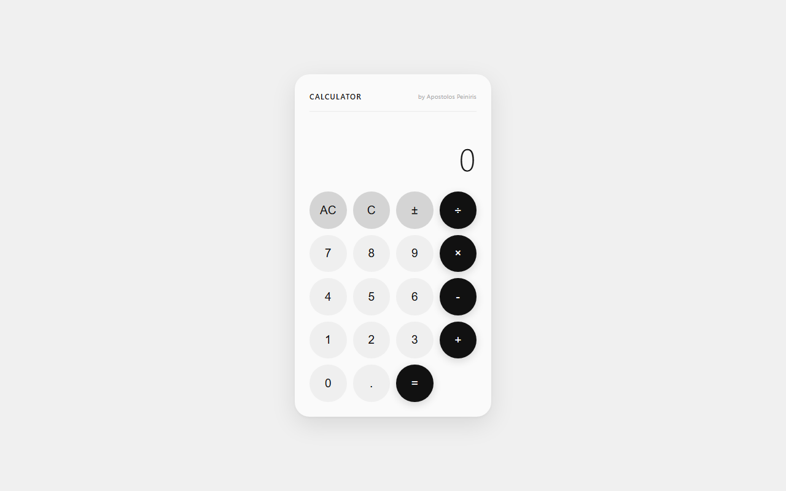

# Calculator

> Minimal 4-function calculator — React + Vite.

[](https://calculator-tpainn.vercel.app)



Simple calculator built while learning React state and component composition. No frameworks beyond React itself, no backend.

## Run locally

```bash
npm install
npm run dev
```
